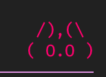
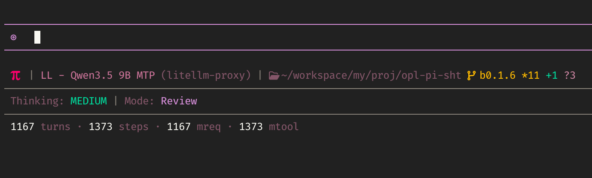
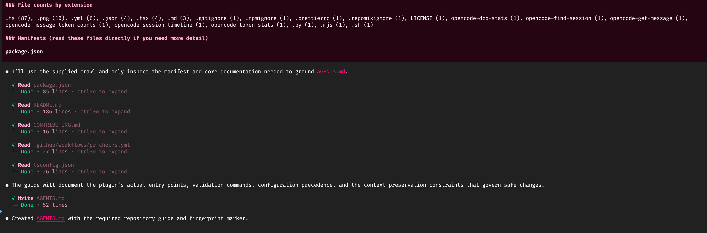
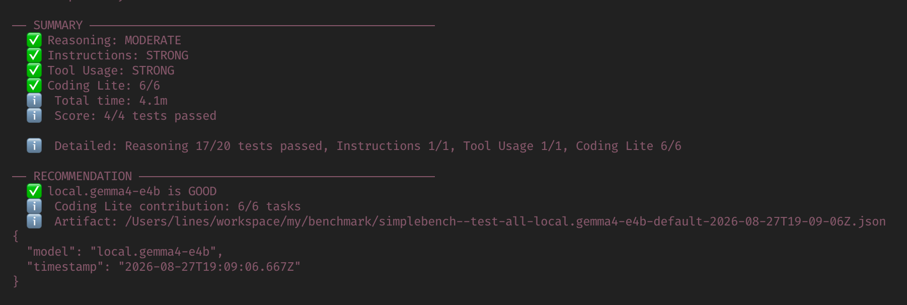
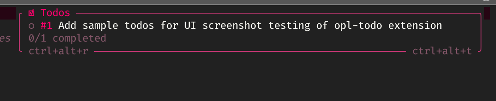
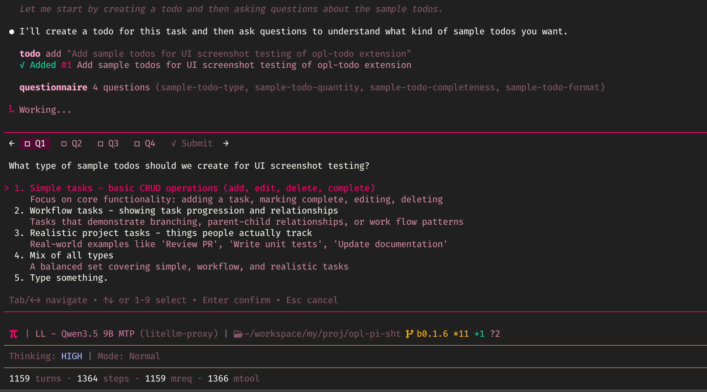
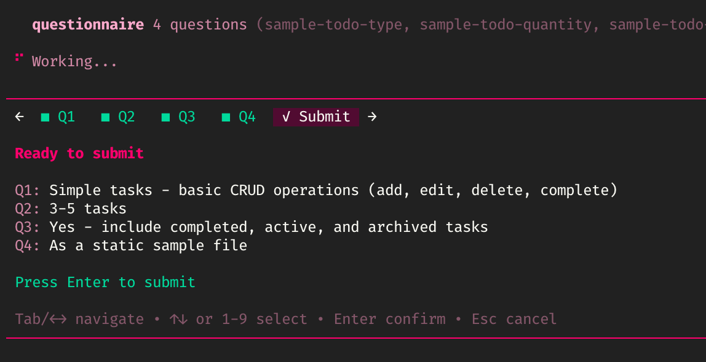
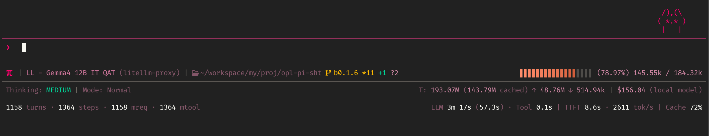

# opl-pi-sht

**Cut token cost, run the agent safely, and drop your MCP servers.**

A portable collection of various Pi coding agent extensions. Repository directories and config files use `opl-`; established Pi-facing commands and tool names stay compatible.

## Installation

### Pi package

Install a versioned GitHub release with Pi:

```bash
pi install git:github.com/linellazatin/opl-pi-sht@v0.1.14
```

Pi installs the package under `~/.pi/agent/git/github.com/linellazatin/opl-pi-sht` and runs root `npm install`, so `opl-webaccess` and `opl-browser` runtime dependencies are available. Pi packages do not install optional extension config files; copy only the configs you need from that checkout to `~/.pi/agent/configs/`.

`opl-browser` also needs Chromium once after package installation:

```bash
cd ~/.pi/agent/git/github.com/linellazatin/opl-pi-sht
npx playwright install chromium
```

### Checkout installer

```bash
chmod +x install.sh
./install.sh                         # copy all extensions and configs
./install.sh --link                  # non-destructive symlinks
./install.sh --only opl-init opl-todo
./install.sh --link --only opl-input # installs the complete UI bundle
PI_AGENT_DIR=/path/to/.pi/agent ./install.sh --link
```

Copy mode overwrites matching destinations. Link mode skips existing destinations. `--only`/`-o` accepts one or more extension names; selecting `opl-footer`, `opl-input`, or `opl-modes` installs all three because they share active-mode state. Use `./install.sh --help` for flags. The repository uses standard `.json` only.

## Extensions


| Extension                                                     | Summary                                                                                                                                                                                                                      | Commands, tools, and configuration                                                                             |
| ------------------------------------------------------------- | ---------------------------------------------------------------------------------------------------------------------------------------------------------------------------------------------------------------------------- | -------------------------------------------------------------------------------------------------------------- |
| [`opl-init`](extensions/opl-init/README.md)                   | Fingerprinted repository-guide generator.                                                                                                                                                                                    | `/init`; no config.                                                                                            |
| [`opl-simplebench`](extensions/opl-simplebench/README.md)     | Auditable provider-aware model benchmark with JSON artifacts and metrics.                                                                                                                                                    | `/simplebench`, `simplebench`; supports Ollama, OpenAI-compatible providers, and Bedrock; optional `opl-simplebench.json`. |
| [`opl-webaccess`](extensions/opl-webaccess/README.md)         | Search plus readable URL/PDF retrieval with session recovery.                                                                                                                                                                | `web_search`, `fetch_content`, `get_search_content`; `opl-webaccess.json`.                                     |
| [`opl-browser`](extensions/opl-browser/README.md)             | Chromium automation via Playwright; single dispatcher tool replacing the chrome-devtools MCP.                                                                                                                                | `browser` (action-based); `opl-browser.json`.                                                                  |
| [`opl-ctxtrim`](extensions/opl-ctxtrim/README.md)             | Trims verbose`ctx_*` tool-schema descriptions on outbound provider requests (~67% smaller schema, ~4,700-6,300 tokens/request). Built specifically for the [context-mode](https://github.com/mksglu/context-mode) extension. | No commands/tools; no config.                                                                                  |
| [`opl-todo`](extensions/opl-todo/README.md)                   | Branch-aware task tool, overlay, and task list.                                                                                                                                                                              | `todo`, `/todos`; `opl-todo.json`.                                                                             |
| [`opl-questionnaire`](extensions/opl-questionnaire/README.md) | Interactive structured-choice tool.                                                                                                                                                                                          | `questionnaire`; no config.                                                                                    |
| [`opl-input`](extensions/opl-input/README.md)                 | Configurable replacement editor - enhanced [pikit chat-input](https://github.com/adrianapan/pikit) (because pet is life, and configurable).                                                                                    | No commands/tools;`opl-input.json`.                                                                            |
| [`opl-modes`](extensions/opl-modes/README.md)                 | Mode, plan, tool-safety, lazy-tool-loading, and active-appearance manager - highly-modified, configrable and enhanced mode-switcher.                                                                                         | `/mode`, `/chat`, `/plan`, `/execute`, `plan_complete`, `load_tools`; `opl-modes.json`.                        |
| [`opl-footer`](extensions/opl-footer/README.md)               | Configurable multi-row status footer - highly-specialized, and enhanced [pikit footer](https://github.com/adrianapan/pikit).                                                                                                  | No commands/tools;`opl-footer.json`.                                                                           |

## What you'll gain

Install one, some, or all. The value is grouped by outcome below, not by extension, so you can pick what matters to you.

### Spend less every session

Two extensions shrink the cached prompt prefix that Pi writes once and re-reads on every turn, so the savings compound across a whole conversation:

- **`opl-ctxtrim`** trims verbose `ctx_*` tool-schema descriptions on outbound requests. It is built specifically for the [context-mode](https://github.com/mksglu/context-mode) extension: ~67% smaller schemas, roughly **4,700-6,300 tokens saved per request**, on every request.
- **`opl-modes` lazy tools** withhold heavy tool schemas (`subagent`, `browser`, `simplebench`, ...) from the resting prefix until the model calls `load_tools`. In a measured `/init` session this removed **~5,000 tokens from the cold cache write (17.6K to 12.6K)** and it repeats every session.

```text
Cold prompt-cache write, measured /init session (opl-modes lazy tools + MCP adapter off)

  before   ██████████████████████████████████  17,558 tokens
  after    █████████████████████████            12,625 tokens   (-28%, ~5K every session)

* token numbers grabbed from my personal setup with ~18 extensions
```

### Run the agent without babysitting it

- **`opl-modes`** chat and plan modes swap the active toolset for read-only lists and gate Bash to safe inspection patterns, with destructive-pattern checks that fire even inside otherwise-safe commands. The plan to execute lifecycle keeps exploration and mutation cleanly separated. Add custom modes (like below) for your workflow needs.

- `load_tools` activation is bounded by the current mode, so a read-only mode cannot be tricked into enabling a write-capable tool.


### Move through work faster

- **`opl-init`** writes a fingerprinted `AGENTS.md` so any agent starts already oriented in a repo. It writes a baseline before asking the model to refine the guide, so smaller models cannot leave the update only in chat; it re-runs only when the tree actually changes.

- **`opl-browser`** gives full Chromium automation (navigate, snapshot, interact, screenshot, console/network capture, evaluate) through a single tool, with handle+preview output for large results.
- **`opl-webaccess`** adds provider-backed search plus readable URL and PDF extraction, with session recovery of earlier results.
- **`opl-simplebench`** benchmarks models on deterministic closed-answer contracts, instruction-following, and tool-call generation so you pick a model on evidence, not vibes.

- **`opl-todo`** tracks branch-aware tasks that persist across a session and reconstruct from history.

- **`opl-questionnaire`** turns an ambiguous fork into a structured choice instead of a guess-and-redo cycle.
 

### See what the agent is doing

- **`opl-footer`** surfaces model, cost, token and cache activity, git state, and per-turn timing in a configurable multi-row footer.
- **`opl-input`** is a configurable editor that reflects the active mode's identity, so you always know which mode you are typing into.


### Fewer moving parts

- **`opl-browser`** replaces the chrome-devtools MCP server. Together these tools let you drop external MCP servers and the idle schema overhead they add to every prompt.

### Pick your footprint

| If you want to...                  | Install                                                         |
| ---------------------------------- | --------------------------------------------------------------- |
| Cut token cost with minimal change | `opl-ctxtrim`, `opl-modes`                                      |
| Run the agent safely on real repos | `opl-modes` (pulls in the `opl-input` + `opl-footer` UI bundle) |
| Research and drive the web         | `opl-webaccess`, `opl-browser`                                  |
| Choose models with data            | `opl-simplebench`                                               |
| The full, coordinated experience   | all ten                                                         |

Selecting `opl-footer`, `opl-input`, or `opl-modes` installs all three, because they share active-mode state.

## Token overhead

Installing extensions adds tool schemas (name + description + JSON parameters) to the resting prompt prefix, which Pi writes once per session and then re-reads cheaply from cache on warm turns. Commands and UI-only extensions add little to nothing. The figures below are calibrated against one tool measured directly in a real session (`load_tools` = 139 tokens); treat them as ±15%.

### Per extension (resting prompt prefix)

| Extension | Adds to resting prompt | Est. tokens |
|---|---|---|
| `opl-browser` | `browser` tool schema | ~554 |
| `opl-questionnaire` | `questionnaire` schema + prompt guidelines | ~532 |
| `opl-webaccess` | `web_search`, `fetch_content`, `get_search_content` | ~394 |
| `opl-simplebench` | `simplebench` schema | ~230 |
| `opl-modes` | `plan_complete` + `load_tools` schemas | ~215 |
| `opl-todo` | `todo` schema | ~92 |
| `opl-init` | command only (no tool) | ~0 |
| `opl-input` | UI only | ~0 |
| `opl-footer` | UI only | ~0 |
| `opl-ctxtrim` | none (payload transformer) | net negative |

Command descriptions add roughly another ~120 tokens collectively, and only if your build surfaces them in the prompt or help block.

### Collective (full install)

- **All tools active (no `lazyTools`):** ~1,916 tool-schema tokens + ~101 guidelines + ~120 commands = **~2,140 tokens** on every cold prompt-cache write.
- **With the recommended `lazyTools` config** (withholds `browser` + `simplebench`, keeps `load_tools`): removing browser (554) and simplebench (230) drops the resting overhead to **~1,356 tokens (-37%)**.

```text
Full install, cold prompt prefix impact

  all tools resting     ████████████████████████  ~2,140 tokens
  with lazyTools        ███████████████            ~1,356 tokens   (-37%)
  + opl-ctxtrim (context-mode)  saves 4,700-6,300 tokens/request
```

The fixed cost of a full install is small and paid once per session, then cached. Two extensions pay it back many times over: `opl-ctxtrim` removes 4,700-6,300 tokens **per request** for context-mode users, and `opl-modes` lazy loading keeps the resting number at ~1,356 instead of ~2,140 while also withholding the heavy `subagent` family (~5K tokens) when present. For a full install, the overhead is modest and one-time-per-session; with context-mode or heavy tools in play, the collection is strongly token-positive.

## Configuration

Copy applicable files from [`configs/`](configs/) to `~/.pi/agent/configs/`. For a Pi Git package installation, the source directory is `~/.pi/agent/git/github.com/linellazatin/opl-pi-sht/configs/`:

- `opl-footer.json`, `opl-input.json`, `opl-modes.json`, `opl-todo.json`, `opl-webaccess.json`
- `opl-browser` has optional configuration (`opl-browser.json`); all fields default, so it works without any config file.
- `opl-simplebench` has optional `opl-simplebench.json`; copy `configs/opl-simplebench.json.sample` to configure DDGS/SearXNG research and llama metadata endpoints.
- `opl-init` and `opl-questionnaire` have no external configuration.
- Config files must be valid JSON, with no comments or trailing commas beyond deliberate `_comment` keys.
- `opl-modes` owns active-mode appearance. Each mode's `appearance.prefix`, `prefixColor`, and `borderColor` style `opl-input`; `appearance.modeColor` styles `opl-footer`'s unified mode label. Renderers retain hardcoded fallbacks.
  - `opl-modes.bashPatterns` is the shared read-only Bash policy for chat and plan. Use per-mode pattern fields only when those modes intentionally need different policies.
  - `opl-modes.lazyTools` withholds heavy tool schemas (e.g. `subagent`, `browser`, `simplebench`) from the resting prefix and enables them on demand via `load_tools`, shrinking the per-session prompt-cache write.

See each extension README for commands, behavior, configuration fields, runtime constraints, and architecture.

## Runtime requirements

All extensions use Pi's normal extension discovery. Pi installs `opl-webaccess` extraction dependencies and Playwright automatically when installed as a Git package. For the checkout installer, install nested runtime dependencies before using those extensions:

```bash
cd extensions/opl-webaccess
npm install

cd ../opl-browser
npm install
npx playwright install chromium
```

A Pi Git package still needs the one-time `npx playwright install chromium` command shown above.

`opl-simplebench` writes a full JSON benchmark artifact in Pi's current working directory by default. `--test-all` additionally writes `research.md` and `page.html` beside `result.json` in a result bundle. Copy `configs/opl-simplebench.json.sample` to `~/.pi/agent/configs/opl-simplebench.json` to configure DDGS/SearXNG research and optional llama-server/llamagputop metadata endpoints. Use `/simplebench --no-artifact` or `simplebench({ no_artifact: true })` when responses must not be written to disk. Provider credentials remain outside tracked configuration; configure them through Pi provider settings, environment variables, or Pi authentication.

## Tests

```bash
npm test
```

Run one extension suite with `npm run test:opl-<name>` for `footer`, `init`, `input`, `modes`, `questionnaire`, `todo`, `webaccess`, `simplebench`, or `ctxtrim`. Every helper, functional, and selected-entrypoint smoke check uses Bun's named-test reporter; output includes per-test status, timings, and pass/fail totals. Functional tests cover deterministic helpers where practical; smoke tests bundle entrypoints and parse config. They do not test live TUI behavior, provider credentials, network access, or PDF extraction.
