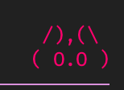
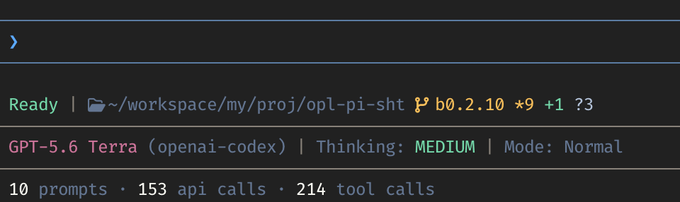
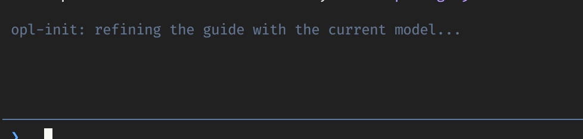
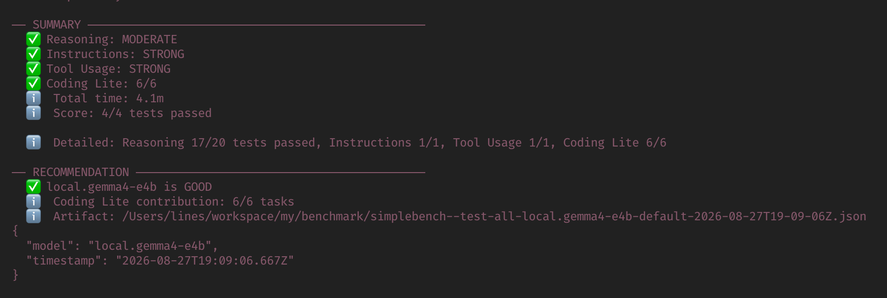
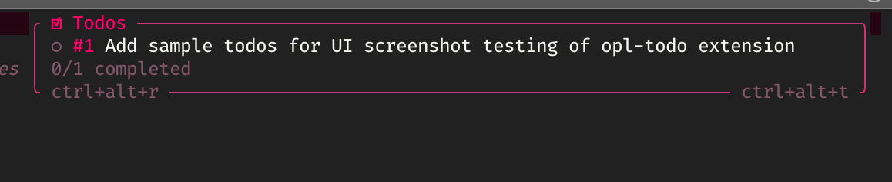
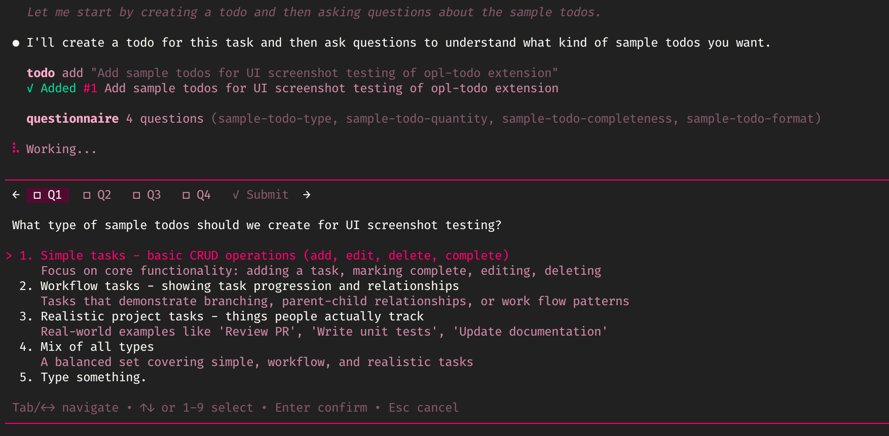
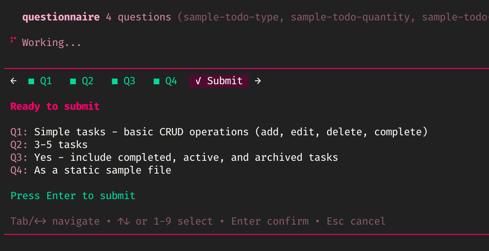
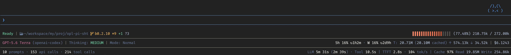

# opl-pi-sht

<div align="center">

[](https://github.com/linellazatin/opl-pi-sht)
[](https://github.com/linellazatin/opl-pi-sht)
[](https://www.npmjs.com/package/@openlines/opl-pi-sht)
[](https://www.npmjs.com/package/@openlines/opl-pi-sht)
[](./LICENSE)

</div>

**Cut token cost, run the agent safely, and drop your MCP servers.**

A portable collection of various Pi coding agent extensions. Repository directories and config files use `opl-`; established Pi-facing commands and tool names stay compatible.

>
> ### v0.3.0 - security hardening, fixes, and extension enhancements
>
> - **Stronger network protection**: [`opl-browser`](extensions/opl-browser/README.md#network-policy) and [`opl-webaccess`](extensions/opl-webaccess/README.md#network-policy) check resolved addresses and redirect destinations, closing hostname and IPv6 policy bypasses. Browser guards also cover page requests, WebSockets and redirected frames. `opl-webaccess` pins each connection to an approved address, closing DNS rebinding on its fetch path; Chromium's internal DNS resolution remains a documented browser limitation.
> - **Safer execution and file access**: [`opl-simplebench`](extensions/opl-simplebench/README.md#coding-lite) limits the environment inherited by model-authored verifier code and uses [argv-based AWS credential lookup](extensions/opl-simplebench/README.md#amazon-bedrock). Guarded git probes in [`opl-init`](extensions/opl-init/README.md#extension-features) and [`opl-footer`](extensions/opl-footer/README.md#git-probing) disable hooks, filesystem monitors and external diff/textconv helpers. Browser screenshots stay within the session project, refuse overwrites and clean up failed captures. Malformed Bash calls are blocked instead of coerced. [Screenshot safety](extensions/opl-browser/README.md#extension-features), [Bash safeguards](extensions/opl-modes/README.md#mode-behavior).
> - **More useful protection and diagnostics**: [`opl-guardian`](extensions/opl-guardian/README.md#forensic-jsonl) matches protected paths without blocking harmless text searches, and its malformed-call logs record argument names rather than values, rotate on a byte limit and live in the agent directory. [Protected paths](extensions/opl-guardian/README.md#protected-paths).
> - **Priority runtime fixes**: PDF extraction accepts HTTP response buffers; URL fetches decode compressed responses within received and decoded byte limits, follow redirects without buffering their bodies, and clean up sockets on cancellation or timeout. [Browser selection](extensions/opl-browser/README.md#extension-features) follows page identity, so a closed tab cannot silently redirect an action to another document. [URL/PDF retrieval](extensions/opl-webaccess/README.md#extension-features).
> - **Lower token cost and better rendering**: [`opl-modes`](extensions/opl-modes/README.md#configuration) enforces UTF-8 plan caps including truncation notices; [`opl-ctxtrim`](extensions/opl-ctxtrim/README.md#scope) trims known context-mode `ctx_*` descriptions in Google/Gemini and OpenAI tool formats; [`opl-webaccess`](extensions/opl-webaccess/README.md#extension-features) stores full results outside the session and returns bounded previews. Footer rows render only when populated, and branch switches or compaction refresh cached counts, cost and context estimates. [Footer behavior](extensions/opl-footer/README.md#features).
> - **More reliable repository context**: [`/init`](extensions/opl-init/README.md#extension-features) handles special characters in workspace globs, bounds fingerprinting work and requests the supported `"minimal"` thinking level. Cross-extension state is validated and cleaned up between sessions. [Cross-extension seams](extensions/opl-footer/README.md#cross-extension-seams).
> - **Organization and convenience**: configs consistently resolve from Pi's agent directory, and plans, screenshots and benchmark artifacts use the session directory. The installer supplies sample configs, preserves existing settings and tracks stale extensions for cleanup or retry. npm packages ship sample configs without checkout live configs; obsolete `models.json` write helpers were removed. [Configuration](#configuration), [Checkout installer](#checkout-installer).
> - **Stronger release checks**: clean installs use a repaired lockfile, release validation runs strict typechecking and the full test suite, and floor CI verifies compatibility against Pi `0.87.0`. `noUncheckedIndexedAccess` remains enabled to catch unsafe array access. [Tests](#tests).
> - **Breaking behavior changes**: loopback access is now opt-in (`allowLoopback: false`), and the entire `64:ff9b:1::/48` local-use translation prefix is blocked even with network opt-ins enabled. The well-known `64:ff9b::/96` prefix still follows embedded-IPv4 policy. Stale browser selections now return an error requiring explicit recovery. [Network policy](extensions/opl-browser/README.md#network-policy), [Page selection](extensions/opl-browser/README.md#extension-features).
>
> See [CHANGELOG](CHANGELOG.md) for more details.
>
> **Validation**: all 11 extensions pass loader checks with Pi `1.1.0`, locked Pi `1.0.0` and the declared `0.87.0` floor.
>

## Installation

### Pi package

Install a versioned release from npm or GitHub. Both ship identical content; pick one source per machine, because Pi treats the npm and Git entries as separate packages and installing both loads every extension twice.

```bash
pi install npm:@openlines/opl-pi-sht@<version>
pi install git:github.com/linellazatin/opl-pi-sht@<version.tag>
```

> Omitting the version on the npm source tracks the latest published release; Git refs stay pinned, so move them with `pi install ...@v<new>`.

Pi installs the package under `~/.pi/agent/npm/node_modules/@openlines/opl-pi-sht` (npm) or `~/.pi/agent/git/github.com/linellazatin/opl-pi-sht` (Git) and runs root `npm install`, so `opl-webaccess` and `opl-browser` runtime dependencies are available. Pi packages do not install optional extension config files; copy only the configs you need from that checkout's `configs/` to `~/.pi/agent/configs/`.

`opl-browser` also needs Chromium once after package installation:

```bash
cd ~/.pi/agent/npm/node_modules/@openlines/opl-pi-sht   # or the git checkout path
npx playwright install chromium
```

#### Selecting extensions

`pi install` has no per-extension flag like `./install.sh --only`. After installing the package, narrow it in `~/.pi/agent/settings.json` using the object form (filters are globs relative to the package root and layer on top of the package manifest):

```json
{
  "packages": [
    {
      "source": "npm:@openlines/opl-pi-sht@0.3.0",
      "extensions": ["extensions/opl-init/index.ts", "extensions/opl-todo/index.ts"]
    }
  ]
}
```

`pi config` provides the same control interactively: toggle individual extensions from an installed package without editing globs.

### Checkout installer

```bash
chmod +x install.sh
./install.sh                         # copy all extensions and configs
./install.sh --link                  # non-destructive symlinks
./install.sh --only opl-init opl-todo
./install.sh --link --only opl-input # installs the complete UI bundle
PI_CODING_AGENT_DIR=/path/to/.pi/agent ./install.sh --link   # PI_AGENT_DIR is a legacy alias
```

Copy mode refreshes extension directories but keeps a config that already exists in the target; pass `--force-configs` to replace it. A config comes from `configs/<name>.json` when the repo carries one, otherwise from the shipped `configs/<name>.json.sample`, so a fresh clone installs defaults instead of silently installing none. What was installed is recorded in `<agent-dir>/extensions/.opl-pi-sht.installed`, and a recorded directory that this release no longer ships is pruned on the next run (`--no-prune` keeps it recorded for later cleanup, and nothing outside the record is ever touched). Failed pruning retains ownership and exits nonzero so the next run can retry; invalid manifest names are ignored. Link mode skips existing destinations without claiming ownership. `--only`/`-o` accepts one or more extension names; selecting `opl-footer`, `opl-input`, or `opl-modes` installs all three because they share active-mode state. Use `./install.sh --help` for flags. The repository uses standard `.json` only.

## Extensions


| Extension                                                     | Summary                                                                                                                                                                                                                      | Commands, tools, and configuration                                                                             |
| ------------------------------------------------------------- | ---------------------------------------------------------------------------------------------------------------------------------------------------------------------------------------------------------------------------- | -------------------------------------------------------------------------------------------------------------- |
| [`opl-init`](extensions/opl-init/README.md)                   | Fingerprinted repository-guide generator with out-of-band model refinement.                                                                                                                                                  | `/init`; no config.                                                                                             |
| [`opl-simplebench`](extensions/opl-simplebench/README.md)     | Auditable provider-aware model benchmark with JSON artifacts and metrics.                                                                                                                                                    | `/simplebench`, `simplebench`; supports Ollama, OpenAI-compatible providers, and Bedrock; optional `opl-simplebench.json`. |
| [`opl-webaccess`](extensions/opl-webaccess/README.md)         | Search plus readable URL/PDF retrieval with session recovery.                                                                                                                                                                | `web_search`, `fetch_content`, `get_search_content`; `opl-webaccess.json`.                                     |
| [`opl-browser`](extensions/opl-browser/README.md)             | Chromium automation via Playwright with structured extraction of rendered pages; single dispatcher tool replacing the chrome-devtools MCP.                                                                                   | `browser` (action-based); `opl-browser.json`.                                                                  |
| [`opl-ctxtrim`](extensions/opl-ctxtrim/README.md)             | Description trimmer specifically for known context-mode `ctx_*` tools in Pi outbound requests, across OpenAI, Anthropic, Mistral, Bedrock and Google/Gemini formats. Its allowlist supplies concise replacements for the [context-mode](https://github.com/mksglu/context-mode) bridge's verbose `ctx_*` descriptions and leaves every other tool byte-for-byte alone (~67-74% smaller tool payloads per measured shape, ~4,700-6,300 tokens/request). | No commands/tools; no config.                                                                                  |
| [`opl-guardian`](extensions/opl-guardian/README.md)           | Configurable tool and session safety: dangerous-Bash confirmation, protected paths, destructive-session confirmation, and malformed-call filtering. | No commands/tools; `opl-guardian.json`. |
| [`opl-todo`](extensions/opl-todo/README.md)                   | Branch-aware task tool, overlay, and task list.                                                                                                                                                                              | `todo`, `/todos`; `opl-todo.json`.                                                                             |
| [`opl-questionnaire`](extensions/opl-questionnaire/README.md) | Interactive structured-choice tool.                                                                                                                                                                                          | `questionnaire`; no config.                                                                                    |
| [`opl-input`](extensions/opl-input/README.md)                 | Configurable replacement editor - enhanced [pikit chat-input](https://github.com/adrianapan/pikit) (because pet is life, and configurable).                                                                                    | No commands/tools;`opl-input.json`.                                                                            |
| [`opl-modes`](extensions/opl-modes/README.md)                 | Mode, plan, tool-safety, lazy-tool-loading, and active-appearance manager - highly-modified, configrable and enhanced mode-switcher.                                                                                         | `/mode`, `/chat`, `/plan`, `/execute`, `plan_complete`, `load_tools`; `opl-modes.json`.                        |
| [`opl-footer`](extensions/opl-footer/README.md)               | Configurable multi-row status footer - highly-specialized, and enhanced [pikit footer](https://github.com/adrianapan/pikit).                                      | `/configure-opl`; `opl-footer.json`.                                                                           |

## What you'll gain

Choose one, some, or all extensions by the outcomes below.

### Spend less every session

Trim tool descriptions or withhold unused schemas to reduce the prompt prefix Pi caches across turns:

- **`opl-ctxtrim`** shortens descriptions for eleven known context-mode `ctx_*` tools across Pi provider formats, preserving other tools, conversation content and schema rules. Measured schemas shrink ~67-74%; the Responses saving is roughly **4,700-6,300 tokens/request**, estimated from bytes. [Scope and provider formats](extensions/opl-ctxtrim/README.md#scope), [Measurements](extensions/opl-ctxtrim/README.md#token-savings).
- **`opl-modes` lazy tools** withhold heavy schemas such as `subagent`, `browser` and `simplebench` until `load_tools` activates them within the current mode's permissions. One measured setup with lazy tools and its MCP adapter disabled saved **~5,000 cold-cache tokens (17.6K to 12.6K)**. [Lazy loading](extensions/opl-modes/README.md#lazy-tool-loading).

```text
Cold prompt-cache write, measured /init session (opl-modes lazy tools + MCP adapter off)

  before   ██████████████████████████████████  17,558 tokens
  after    █████████████████████████            12,625 tokens   (-28%, ~5K every session)

* token numbers grabbed from my personal setup with ~18 extensions
```

### Run the agent without babysitting it

- **`opl-modes`** provides read-only chat/plan toolsets, checks each Bash command segment including quoted substitutions, and blocks destructive operations. Custom modes support exploration-to-execution workflows; `load_tools` cannot exceed their permissions. Plan copies stay within UTF-8 caps including truncation notices: **24 KB** in prompts and **4 KB** in session entries, with the full file retained. Execute auto-exit requires Pi >=0.87.0. [Mode behavior](extensions/opl-modes/README.md#mode-behavior), [Plan configuration](extensions/opl-modes/README.md#configuration).


- **`opl-guardian`** confirms dangerous Bash commands and destructive session actions, and protects configured file paths through symlink resolution. Without a UI, confirmation-required actions block. Bash path matching avoids harmless text-search matches but remains advisory, not a shell sandbox. Malformed calls are removed before persistence/replay; byte-rotated logs in `<agent dir>/guardian-incidents.jsonl` record argument names, never values. [Guards](extensions/opl-guardian/README.md#what-it-guards), [Forensics](extensions/opl-guardian/README.md#forensic-jsonl).

### Move through work faster

- **`opl-init`** crawls, writes and reloads `AGENTS.md` using one out-of-band refinement call. An unchanged fingerprint skips the model; mid-session requests wait for the agent to settle. No synthetic user messages. Requires Pi >=0.86.0. [Workflow](extensions/opl-init/README.md#extension-features).

- **`opl-browser`** exposes Chromium navigation, snapshots, rendered Markdown, interaction, screenshots, diagnostics and evaluation through one tool, with paged previews for large results. Address-based guards cover navigation, page requests, WebSockets and redirected frames; private/link-local access is blocked by default, loopback is opt-in, metadata is always blocked and service workers are disabled. PNG/JPG screenshots are contained within the session project and reserved against overwrites. Page actions support `index`, preserve selection identity and reject stale targets. [Features](extensions/opl-browser/README.md#extension-features), [Network policy and limits](extensions/opl-browser/README.md#network-policy).
- **`opl-webaccess`** provides search, readable URL/PDF extraction and result recovery. HTTP(S) fetches validate and pin approved addresses at every redirect, block private/link-local hosts by default, make loopback opt-in and always block metadata/unspecified addresses. Compressed responses are decoded within **10 MB** received/decoded caps and a **30 s** deadline across hops. Sessions keep bounded previews; full results live in a **1 h / 32 MB** disk cache. [Retrieval and storage](extensions/opl-webaccess/README.md#extension-features), [Configuration](extensions/opl-webaccess/README.md#configuration).
- **`opl-simplebench`** compares models using deterministic answers, instruction-following, tool calls and coding tasks. Model-authored verifier code and its children receive an allowlisted environment without provider credentials, tokens or agent paths; this is not filesystem/network isolation. [Methodology](extensions/opl-simplebench/README.md#benchmark-methodology), [Coding safety](extensions/opl-simplebench/README.md#coding-lite).

- **`opl-todo`** persists branch-aware tasks, reconstructs them from session history and sizes its overlay to the renderer's terminal. [Features](extensions/opl-todo/README.md#extension-features).

- **`opl-questionnaire`** resolves ambiguous choices through an interactive structured questionnaire. [Features](extensions/opl-questionnaire/README.md#extension-features).
 

### See what the agent is doing

- **`opl-footer`** shows model, cost, tokens/cache, git state, agent activity and timing, plus optional Codex subscription quota and OpenRouter key usage. Empty rows disappear; failed segments show `[?]` without blanking the footer. Branch switches and compaction refresh cached facts, and canonical context usage replaces estimates. Quotas refresh during runs with a 30 s minimum interval; OpenRouter keys/responses are never logged or persisted. Configure the layout with `/configure-opl`. [Features](extensions/opl-footer/README.md#features), [Usage segments](extensions/opl-footer/README.md#available-segments).
- **`opl-input`** provides a configurable editor that reflects the active mode. [Editor features](extensions/opl-input/README.md#extension-features).


### Fewer moving parts

- **`opl-browser`** provides browser automation without a separate chrome-devtools MCP server, reducing server setup and idle schema overhead. [Architecture](extensions/opl-browser/README.md#architecture).

### Pick your footprint

| If you want to...                  | Install                                                         |
| ---------------------------------- | --------------------------------------------------------------- |
| Cut token cost with minimal change | `opl-ctxtrim`, `opl-modes`                                      |
| Run the agent safely on real repos | `opl-modes` (pulls in the `opl-input` + `opl-footer` UI bundle), `opl-guardian` |
| Research and drive the web         | `opl-webaccess`, `opl-browser`                                  |
| Choose models with data            | `opl-simplebench`                                               |
| The full, coordinated experience   | all eleven                                                      |

Selecting `opl-footer`, `opl-input`, or `opl-modes` installs all three, because they share active-mode state.

## Token overhead

Installing extensions adds tool schemas (name + description + JSON parameters) to the resting prompt prefix, which Pi writes once per session and then re-reads cheaply from cache on warm turns. Commands and UI-only extensions add little to nothing. The figures below are calibrated against one tool measured directly in a real session (`load_tools` = 139 tokens); treat them as ±15%. Per-row estimates sum a little above the measured whole (~2,020 against ~1,916 of tool-schema tokens), so the collective figures below use the measured value.

### Per extension (resting prompt prefix)

| Extension | Adds to resting prompt | Est. tokens |
|---|---|---|
| `opl-browser` | `browser` tool schema | ~596 |
| `opl-questionnaire` | `questionnaire` schema + prompt guidelines | ~532 |
| `opl-webaccess` | `web_search`, `fetch_content`, `get_search_content` | ~394 |
| `opl-simplebench` | `simplebench` schema | ~230 |
| `opl-modes` | `plan_complete` + `load_tools` schemas | ~215 |
| `opl-todo` | `todo` schema | ~92 |
| `opl-init` | command only (no tool) | ~0 |
| `opl-input` | UI only | ~0 |
| `opl-footer` | UI only | ~0 |
| `opl-guardian` | none (tool/session safety; no added tool schemas) | ~0 |
| `opl-ctxtrim` | none (payload transformer) | net negative |

Command descriptions add roughly another ~120 tokens collectively, and only if your build surfaces them in the prompt or help block.

### Collective (full install)

- **All tools active (no `lazyTools`):** ~1,958 tool-schema tokens (the ~1,916 counted in a real session, plus the ~42 tokens Phase 6 added to the `browser` schema for page targeting) + ~101 guidelines + ~120 commands = **~2,180 tokens** on every cold prompt-cache write. The per-extension rows above are ±15% estimates of the same set and sum slightly over it.
- **With the recommended `lazyTools` config** (withholds `browser` + `simplebench`, keeps `load_tools`): removing browser (~596) and simplebench (~230) drops the resting overhead to **~1,354 tokens (-38%)**.

```text
Full install, cold prompt prefix impact

  all tools resting     ████████████████████████  ~2,180 tokens
  with lazyTools        ███████████████            ~1,354 tokens   (-38%)
  + opl-ctxtrim (curated ctx_*)  saves 4,700-6,300 tokens/request
```

The fixed cost of a full install is small and paid once per session, then cached. Two extensions pay it back many times over: `opl-ctxtrim` removes 4,700-6,300 tokens **per request** for context-mode users, and `opl-modes` lazy loading keeps the resting number at ~1,354 instead of ~2,180 while also withholding the heavy `subagent` family (~5K tokens) when present. For a full install, the overhead is modest and one-time-per-session; with context-mode or heavy tools in play, the collection is strongly token-positive.

## Configuration

Copy applicable files from [`configs/`](configs/) to `~/.pi/agent/configs/` - or to `$PI_CODING_AGENT_DIR/configs/` if you relocated the agent directory, which is where every extension in this collection looks, per call. npm packages include only shipped `.json.sample` configs, never operator `.json` files from a checkout. For a Pi package installation, the source directory is `~/.pi/agent/npm/node_modules/@openlines/opl-pi-sht/configs/` (npm) or `~/.pi/agent/git/github.com/linellazatin/opl-pi-sht/configs/` (Git):

- `opl-footer.json`, `opl-input.json`, `opl-modes.json`, `opl-todo.json`, `opl-webaccess.json`, `opl-guardian.json`
- `opl-browser` has optional configuration (`opl-browser.json`); all fields default, so it works without any config file.
- `opl-simplebench` has optional `opl-simplebench.json`; copy `configs/opl-simplebench.json.sample` to configure DDGS/SearXNG research and llama metadata endpoints.
- `opl-guardian` has an optional `opl-guardian.json`; copy `configs/opl-guardian.json.sample` and manually migrate any old permission-gate or protected-path settings. It does not load legacy files. Configured `permissionGate.patterns` replace the defaults, so copied live patterns do not automatically inherit later default-rule updates.
- `opl-init` and `opl-questionnaire` have no external configuration.
- Config files must be valid JSON, with no comments or trailing commas beyond deliberate `_comment` keys.
- `opl-modes` owns active-mode appearance. Each mode's `appearance.prefix`, `prefixColor`, and `borderColor` style `opl-input`; `appearance.modeColor` styles `opl-footer`'s unified mode label. Renderers retain hardcoded fallbacks.
  - `opl-modes.bashPatterns` is the shared read-only Bash policy now applied to every mode by default; a mode overrides it with its own valid `safePatterns`/`destructivePatterns` array, an empty array explicitly removes that policy, or `unrestrictedBash: true` disables both gates. Malformed per-mode arrays retain the existing policy.
  - `opl-modes.lazyTools` withholds heavy tool schemas (e.g. `subagent`, `browser`, `simplebench`) from the resting prefix and enables them on demand via `load_tools`, shrinking the per-session prompt-cache write.

See each extension README for commands, behavior, configuration fields, runtime constraints, and architecture.

## Runtime requirements

All extensions use Pi's normal extension discovery. Pi installs `opl-webaccess` extraction dependencies and Playwright automatically when installed as an npm or Git package. For the checkout installer, install nested runtime dependencies before using those extensions:

```bash
cd extensions/opl-webaccess
npm install

cd ../opl-browser
npm install
npx playwright install chromium
```

A Pi package (npm or Git) still needs the one-time `npx playwright install chromium` command shown above.

`opl-simplebench` writes a full JSON benchmark artifact in the current Pi session directory (`ExtensionContext.cwd`). `--test-all` additionally writes `research.md` and `page.html` beside `result.json` in a result bundle. Without an active session context, artifacts fall back to the harness working directory. `/simplebench --sequence[=<name>]` runs a named templated multi-run protocol (for example a model warm-up curve) defined in the `runSequence.sequences` block, with per-iteration tags, optional llama-server/llamagputop metrics, and a configurable pause between iterations; block-level `llamaMetrics`/`pauseMs` are defaults a profile can override. Copy `configs/opl-simplebench.json.sample` to `~/.pi/agent/configs/opl-simplebench.json` to configure DDGS/SearXNG research, optional llama-server/llamagputop metadata endpoints, and the run sequence. Use `/simplebench --no-artifact` or `simplebench({ no_artifact: true })` when responses must not be written to disk. Provider credentials remain outside tracked configuration; configure them through Pi provider settings, environment variables, or Pi authentication.

## Tests

```bash
npm test
```

`npm run test:shared` runs the cross-extension checks: agent-directory resolution, parity of the duplicated host and git guards, installer, package metadata, and the `globalThis` seams between `opl-modes`, `opl-footer` and `opl-input`. `npm run typecheck` runs `tsc` in strict mode over all 86 extension sources and is separate from `npm test`. Release validation uses `npm ci`, strict typechecking and the full suite; package tests exercise npm packing to exclude live configs. Run one extension suite with `npm run test:opl-<name>` for `browser`, `footer`, `guardian`, `init`, `input`, `modes`, `questionnaire`, `todo`, `webaccess`, `simplebench`, or `ctxtrim`. `npm run test:pi-host` uses the Pi build this machine actually runs (the installed managed release, falling back to the `>=0.87.0` devDependency when none is present) and its real extension loader to load every entrypoint and assert no loader errors. Every helper, functional, and selected-entrypoint smoke check uses Bun's named-test reporter; output includes per-test status, timings, and pass/fail totals. Functional tests cover deterministic helpers where practical; smoke tests bundle entrypoints and parse config. They do not test live TUI behavior, provider credentials, network access, or PDF extraction.

For agents/models testing extensions in a running Pi session, follow the [live-test instructions](tests/support/opl-live-test.md): one extension per phase, safe tool probes, operator-assisted UI checks, and separate reporting of live observations, automated coverage, and unverified behavior.